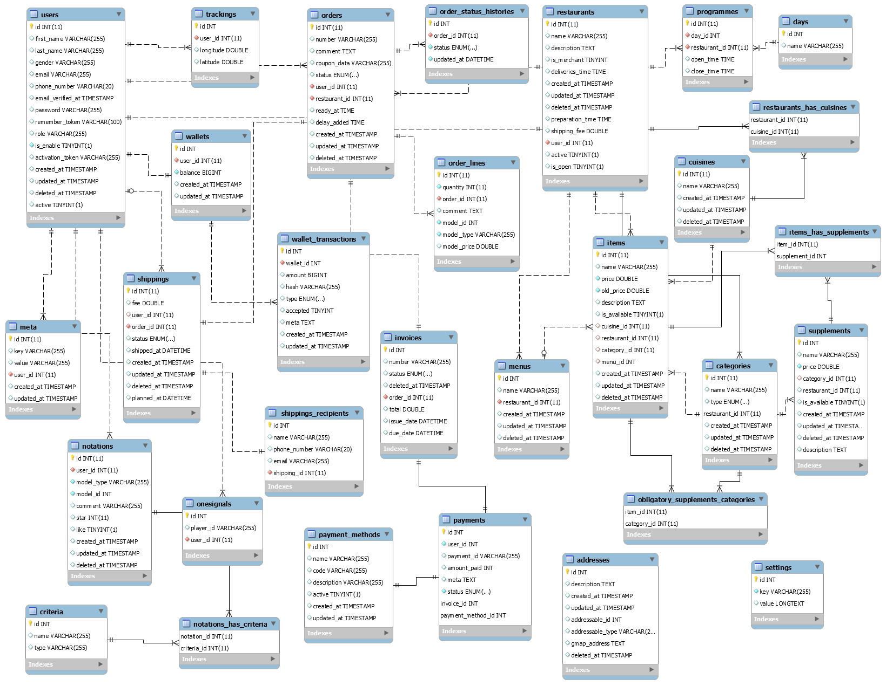

## About Ubereats Clone

Build with laravel 5.8


## The Database Schema Design



## Instal Ubereats Clone Demo

1. Run in your terminal:

```
git clone https://github.com/bleriotnoguia/ubereats-clone.git
```

1. Set your database information in your .env file ;

2. Run the command bellow

Before run the command, first download [ubereats.sql](https://github.com/bleriotnoguia/ubereats-clone/blob/main/ubereats.sql) file and import it via mysql in other to create ubereats database and tables.

```
cd path/to/projet
php artisan ubereats:install
```

Create admin by running the command below

```
php artisan ubereats:admin
```

3. set your smtp (maybe mailtrap for test) information in your .env file

Create demo data by running the command below

```
php artisan ubereats:demo
```

## How does the Ubereats Clone API Work ?

Please see [RESTAPI](https://github.com/bleriotnoguia/ubereats-clone/blob/main/RESTAPI.md) for details.

## Useful links

- The template use for dashbord is [adminlte](http://adminlte.io/).
- The framework : [Laravel docs](https://laravel.com/docs/5.7/).

## Change log

Please see [CHANGELOG](https://github.com/bleriotnoguia/ubereats-clone/blob/main/CHANGELOG.md) for more information what has changed recently.

## License

Lorem ipsum dolor sit amet consectetur adipisicing elit.
